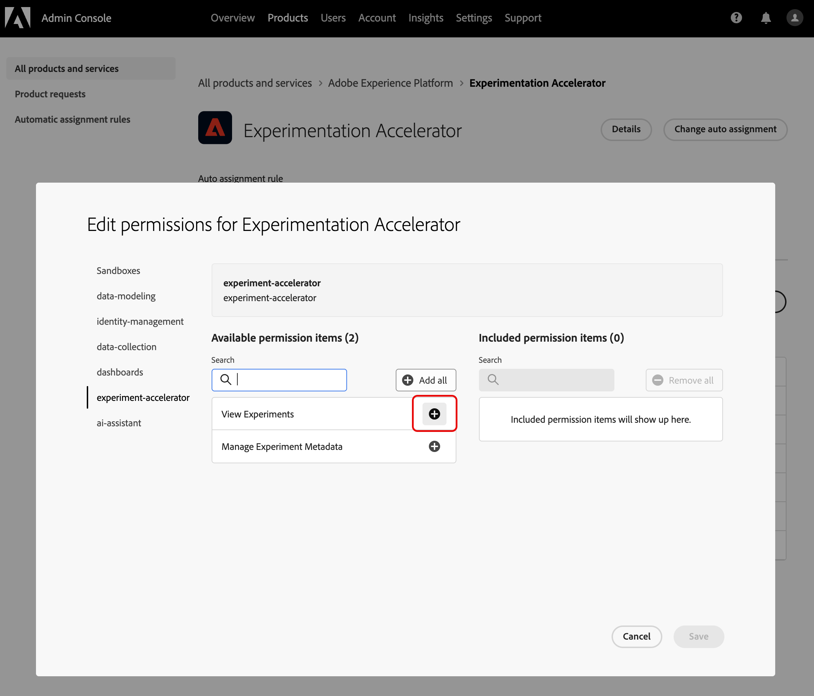

# Accedere a Journey Optimizer Experimentation Accelerator

Dopo [aver creato e configurato l&#39;esperimento](https://experienceleague.adobe.com/en/docs/journey-optimizer/using/content-management/content-experiment/content-experiment) e aver inviato le campagne o i percorsi ai profili, puoi accedere a **[!UICONTROL Journey Optimizer Experimentation Accelerator]** per approfondire le prestazioni dell&#39;esperimento.

Puoi accedere a **[!UICONTROL Journey Optimizer Experimentation Accelerator]** dal menu a sinistra dal menu a discesa [!UICONTROL Sperimentazione] o tramite il selettore App. Gli utenti con una sola licenza di Target possono accedervi solo tramite il selettore App.

Gli esperimenti disponibili dipendono dalla configurazione:

* **Per gli utenti di Adobe Journey Optimizer**: gli esperimenti configurati nella sandbox dell&#39;organizzazione abilitata vengono inclusi automaticamente.

* **Per gli utenti di Adobe Target con Journey Optimizer**: tutte le attività A/B in Target vengono visualizzate in **[!UICONTROL Journey Optimizer Experimentation Accelerator]** nella sandbox di produzione di Journey Optimizer.

* **Per utenti solo Adobe Target**: tutte le attività A/B nell&#39;organizzazione di Target sono incluse nella sandbox di produzione di Journey Optimizer.

Per utilizzare **[!UICONTROL Journey Optimizer Experimentation Accelerator]**, è necessario accedere alla sandbox e alle seguenti autorizzazioni correlate:

* **[!UICONTROL Visualizza esperimenti]**
* **[!UICONTROL Gestisci Metada esperimento]**

+++ Scopri come assegnare le autorizzazioni relative a Experience con una licenza di Adobe Experience Platform o Adobe Percorsi Optimizer

1. Nel prodotto **[!DNL Permissions]**, vai alla scheda **[!UICONTROL Ruoli]** e seleziona il **[!UICONTROL Ruolo]** desiderato.

1. Fai clic su **[!UICONTROL Modifica]** per modificare le autorizzazioni.

1. Aggiungi la risorsa **[!UICONTROL Acceleratore esperimento]**, quindi seleziona **[!UICONTROL Visualizza esperimenti]** e/o **[!UICONTROL Gestisci esperimento Metada]** dal menu a discesa.

   

1. Fai clic su **[!UICONTROL Salva]** per applicare le modifiche.

Le autorizzazioni degli utenti già assegnati a questo ruolo verranno aggiornate automaticamente.

Per assegnare questo ruolo ai nuovi utenti:

1. Passa alla scheda **[!UICONTROL Utenti]** nel dashboard Ruoli e fai clic su **[!UICONTROL Aggiungi utente]**.

1. Immetti il nome o l’indirizzo e-mail dell’utente o sceglilo dall’elenco e fai clic su **[!UICONTROL Salva]**.

   Se l&#39;utente non è stato creato in precedenza, consulta [questa documentazione](https://experienceleague.adobe.com/it/docs/experience-platform/access-control/abac/permissions-ui/users).

L’utente riceverà un’e-mail con istruzioni per accedere all’istanza.

+++

 

+++ Scopri come assegnare le autorizzazioni relative all’esperimento con la licenza di Adobe Target

1. Apri **[Admin Console](http://adminconsole.adobe.com/)**.

1. In **[!UICONTROL Prodotti]** scegliere **[!UICONTROL Adobe Experience Platform]**.

1. Fare clic su **[!UICONTROL Nuovo profilo]**.

   

1. Immetti **[!UICONTROL Nome]** e **[!UICONTROL Descrizione]** per il profilo, quindi fai clic su **[!UICONTROL Salva]**.

1. Apri il **[!UICONTROL profilo]** appena creato e passa alla scheda **[!UICONTROL Autorizzazioni]**.

1. Fai clic su  accanto all&#39;autorizzazione **[!UICONTROL experiment-accelerator]**.

   

1. Aggiungi le autorizzazioni che questo profilo deve avere, ad esempio **[!UICONTROL Visualizza esperimenti]** e **[!UICONTROL Gestisci metadati esperimenti]**, quindi fai clic su **[!UICONTROL Salva]**.

   >[!TIP]
   >
   > Crea profili separati quando gli utenti necessitano di livelli di accesso diversi. Ad esempio, crea un profilo **[!UICONTROL Experimentation Accelerator Viewer]** con solo **[!UICONTROL Visualizza esperimenti]** e un profilo **[!UICONTROL Experimentation Accelerator Editor]** con entrambi **[!UICONTROL Visualizza esperimenti]** e **[!UICONTROL Gestisci metadati esperimenti]**.

   

1. Dalla scheda **[!UICONTROL Autorizzazioni]**, seleziona **[!UICONTROL Sandbox]**.

1. Aggiungi le sandbox in cui gli utenti dovrebbero poter utilizzare Journey Optimizer Experimentation Accelerator, quindi fai clic su **[!UICONTROL Salva]**.

1. Apri la scheda **[!UICONTROL Utenti]**, quindi fai clic su **[!UICONTROL Aggiungi utenti]**.

   

1. Aggiungi gli utenti che devono ricevere questo accesso, quindi fai clic su **[!UICONTROL Salva]**.

Gli utenti aggiunti a questo profilo ora possono accedere a Journey Optimizer Experimentation Accelerator dal commutatore dell’app.

+++

<!--
table style="table-layout:fixed"><tr style="border: 0;">
<td>

<strong><a href="experiment-accelerator-overview.md">Overview</a></strong>

</td>
<td>

<strong><a href="experiment-accelerator-monitor.md">Experiments</a></strong>

</td>
<td>

<strong><a href="experiment-accelerator-metrics.md">Metrics</a></strong>

</td>
</tr></table
-->
